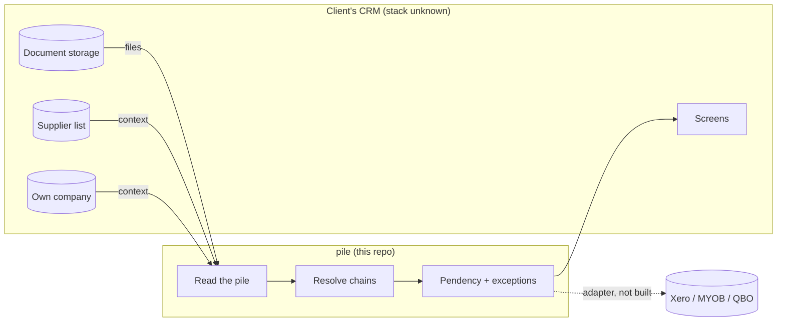
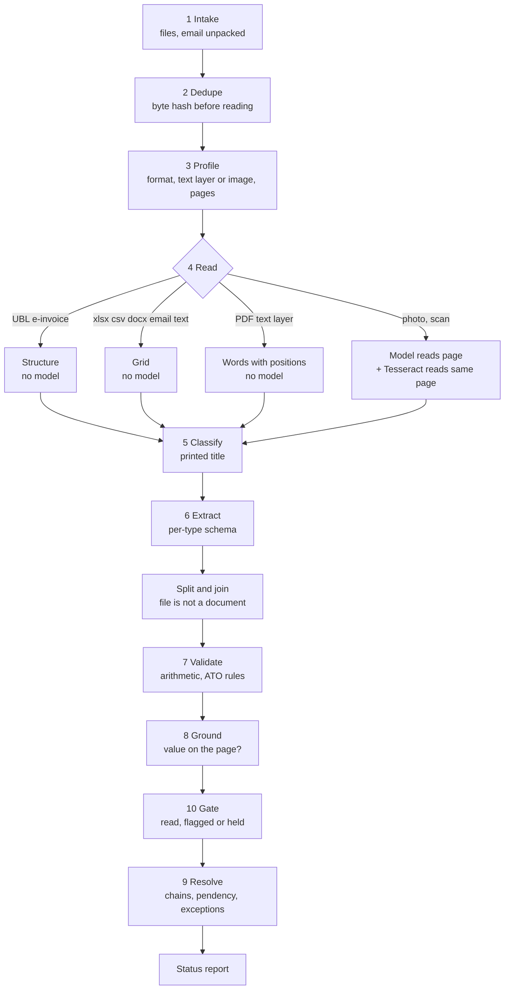
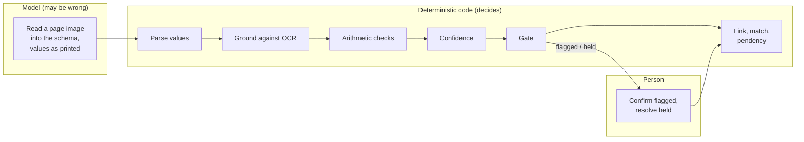
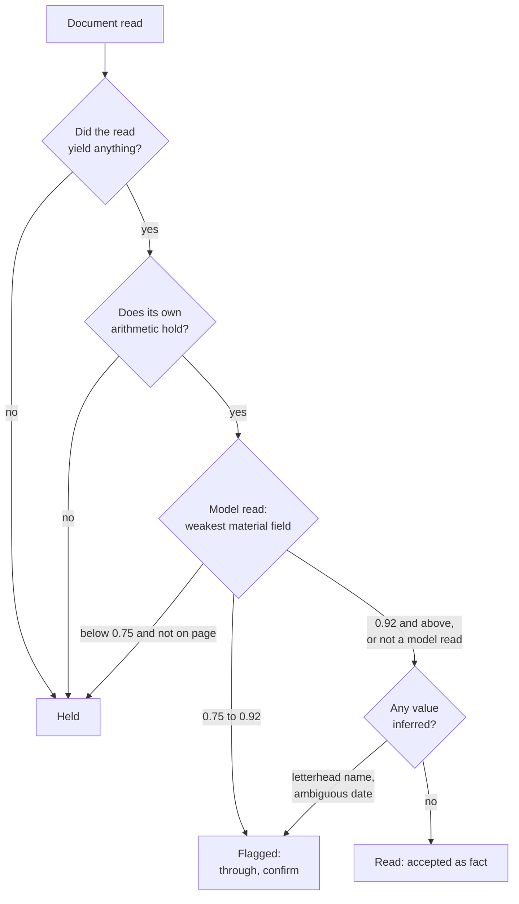
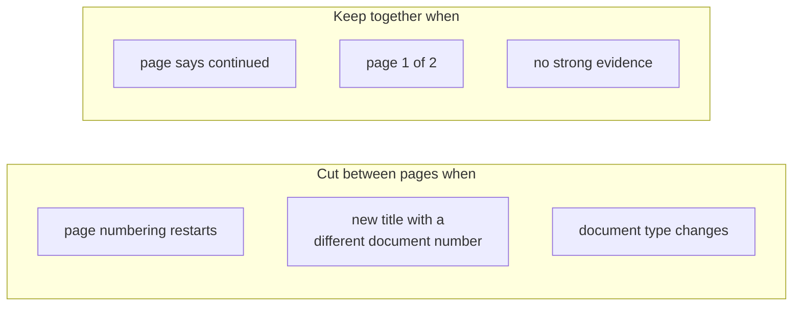
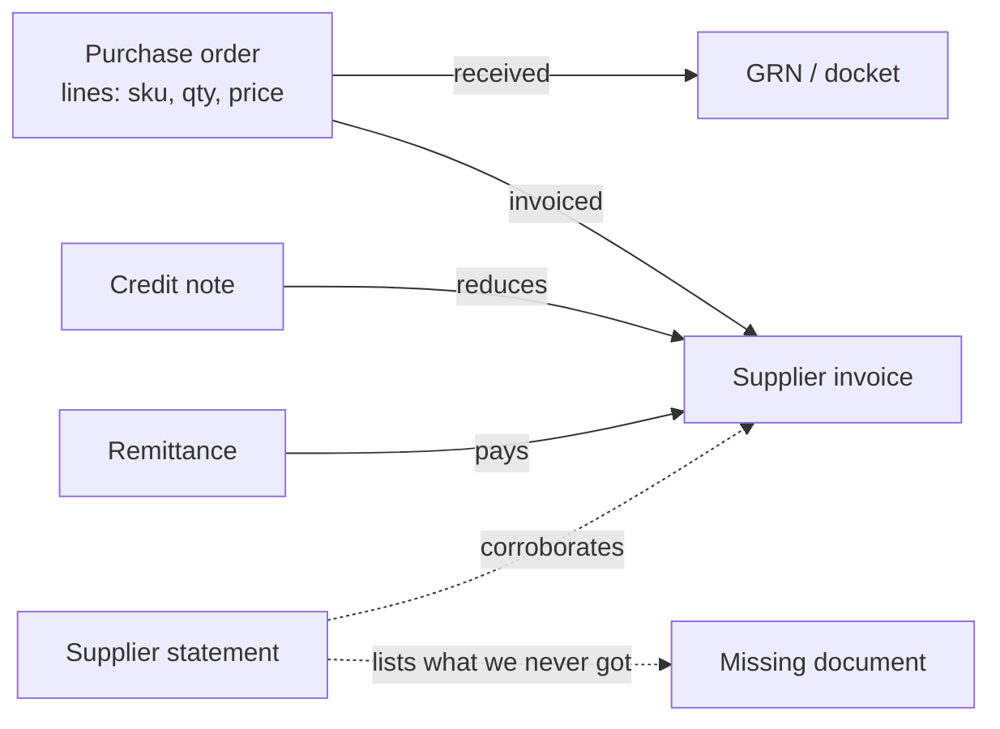
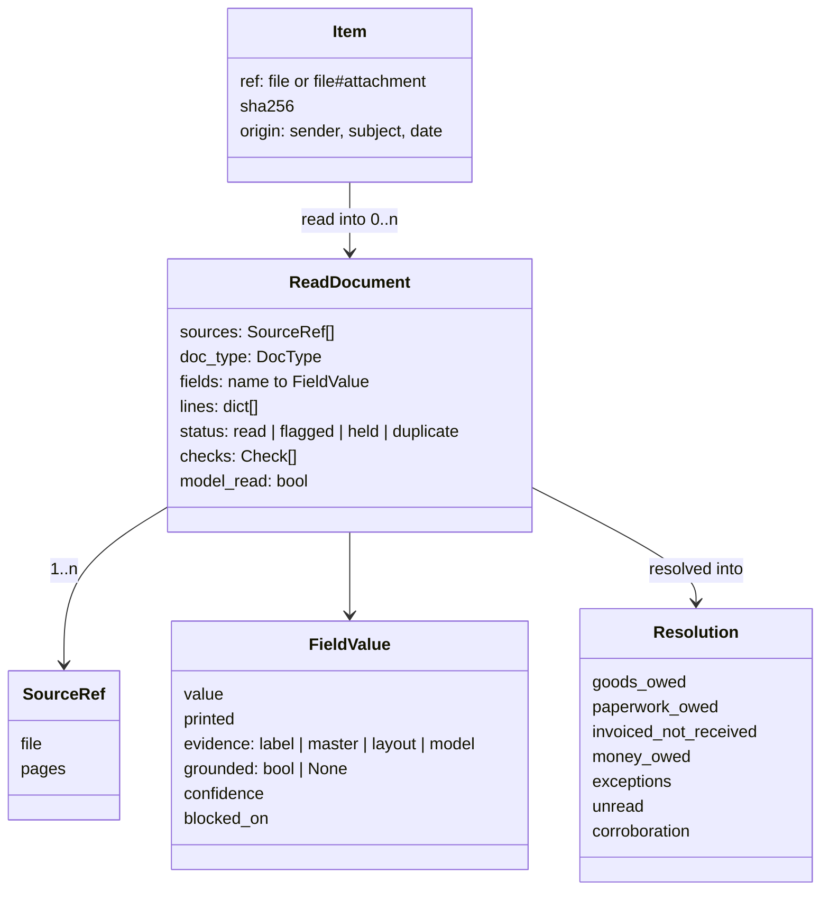
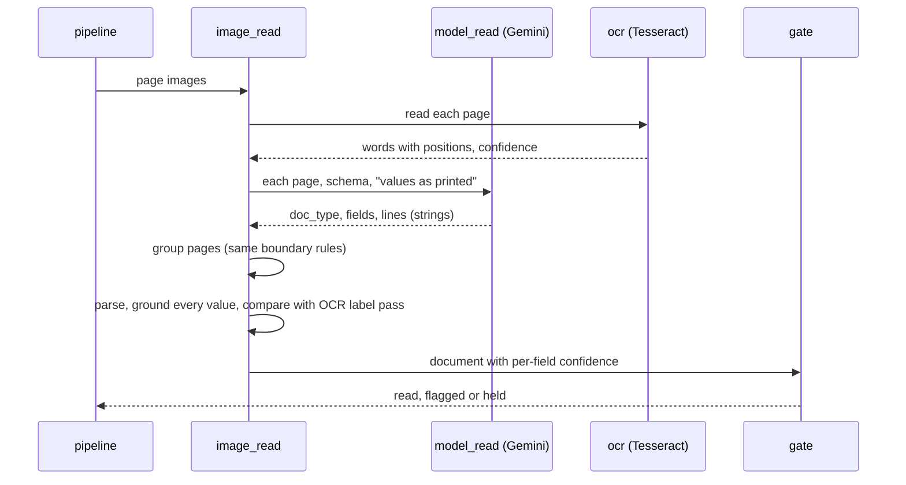

# Architecture

## 1. Placement

The module sits inside the client's CRM. It reads the documents the CRM already stores, uses
what the CRM already knows (its own company, its supplier list, later its jobs), and hands back
chains, pendency and exceptions. Posting to an accounting package goes out through one adapter
(not built).

## 2. The pipeline

Ten stages from "Reading the Pile" (design, 14 Sep). The cheap, certain stages run first;
reading is the expensive step, so nothing is read twice.

Stage numbers follow the design; in code, grounding and the gate run inside `pipeline.gate`
and `image_read`, and resolution runs over everything that passed.

## 3. The trust boundary

The model occupies exactly one box, and it is not a box that changes a number.

`tests/test_trust_boundary.py` fails the build if any deciding module can import a model
client or the model reader. Only `model_read.py` may import one.

## 4. Reading without guessing

Every accepted value has evidence. Evidence is recorded per field (`FieldValue.evidence`,
`FieldValue.printed`, `FieldValue.grounded`).

| Source of a value | Evidence required | If missing |
|---|---|---|
| UBL e-invoice | the element that holds it | not applicable |
| Spreadsheet, Word, email, PDF text | a printed label, or a column heading over it | left blank |
| Supplier name | supplier list match, or a label; letterhead only with a flag | blank, or flagged |
| Numeric date like 03/04/2026 | an unambiguous date or an ABN on the same document | flagged |
| Model reading of an image | found on the page by Tesseract as a whole token | capped at 0.35 confidence, held |
| Line numbers from a model | every quantity, price, amount, code on the page | document held |
| Totals | lines sum to subtotal, subtotal plus GST to total, GST 10% | document held |

A number inside a longer code does not ground: quantity 12 is not found in `TMB-140x45-MGP12`.

## 5. The gate

`blocked_on` says why: `extraction_quality` (we read it badly; a better reader or a person
fixes it) or `corroboration` (fine as read, waiting on other documents). Thresholds are
uncalibrated.

## 6. Split and join

A wrong split is silent (two half-invoices, each plausible). A wrong join is loud (the
arithmetic fails). So pages are cut only on strong evidence.

Joining across files: a page that says it continues, arriving as its own file, attaches to the
document whose number it names.

## 7. Resolution

Links, in order of trust:

1. **The PO number printed on the document**, accepted only if the supplier matches the PO's
   (a PO number quoted by another supplier is not trusted).
2. **An auditable score** when no usable number: supplier 0.35, amount 0.25, date 0.15, line
   overlap 0.25. At or above 0.85 links; 0.60 to 0.85 links with low confidence; below, no
   matching PO.

Line matching: same SKU; else the PO's SKU printed inside the description; else description
word overlap of 0.6 or more.

Registers, per PO line:

- goods owed = ordered minus received
- paperwork owed = received minus (invoiced minus credited)
- invoiced not received = (invoiced minus credited) minus received
- money owed, per invoice = total minus credits minus remitted

Exceptions: price variance (beyond 2%, the brief's example tolerance), quantity variance
(resolved when a credit brings net invoiced down to received), no matching PO, duplicate
suspected (same type, supplier and number from different files), missing receipt, missing
document (on a statement, never received). Unread documents make the report provisional, and
when OCR can see which PO an unread docket names, the exception says so.

## 8. Data model

Eight document types, each with its own header fields (`models.HEADER_FIELDS`) and its own
check (`validate.py`):

| Type | Own check |
|---|---|
| supplier_invoice | lines multiply out, sum to subtotal; subtotal + GST = total; GST 10%; ATO fields |
| credit_note | same arithmetic; names the invoice it credits |
| goods_receipt | quantities present; quotes a PO |
| statement | opening + entries = closing balance |
| price_schedule | effective dates in order; prices present |
| purchase_order | same arithmetic as an invoice |
| remittance | allocations sum to amount remitted |
| unknown | none; held |

## 9. Model path detail

With no model configured, OCR only labels the document provisionally (type, number, PO) so the
report can say what is waiting; the document is held. OCR is not trusted to read line items:
on a tilted photo it attaches quantities to the wrong rows, and a docket has no arithmetic to
catch that.

## 10. What is not built

Tolerance scoping and rule learning, blast-radius preview, landed cost, GL posting adapter,
screens, background worker, authentication, tenancy, job coding, price schedule variance
checks. The 9 Sep build had several of these; they were lost with its workspace. See
`07-open-questions.md`.
