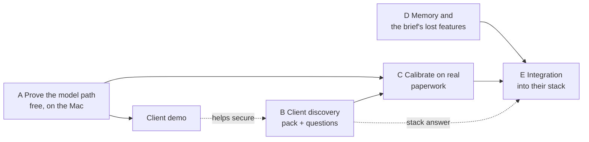

# Next phase: from rehearsal to real paperwork

Written 26 Sep 2026. Supersedes the execution sequence in the 14 Sep requirement ledger, which
assumed the lost 9 Sep build.

## Where we are

The reading and resolving core works and is honest about what it does not know: 43 tests,
0 wrong values accepted as fact on both test corpora, every seeded figure reproduced from a
perfect reading. But every number so far comes from documents we wrote or from foreign
invoices, the model path has never run live, and the module keeps no memory between runs.

## The goal of this phase

**Show the client their own paperwork resolved correctly, with measured accuracy, running in a
shape that can go into their CRM.** Three things stand between here and there, in order of how
much they block:

1. **Their documents.** Nothing about accuracy is known until the sample pack arrives.
2. **Memory.** A real pile arrives a few documents at a time over weeks. Today `pile` re-reads
   a folder from scratch and forgets every human decision.
3. **Their stack.** Needed only for the final integration step.

## The plan

Five streams. A and B start now and run side by side; B is the critical path because it waits
on the client.

### A. Prove the model path (now, free)

Outcome: know whether the free model reads photos and scans well enough to carry on without
paying yet.

- Run `docs/02-model-testing.md` on the Mac: Tesseract, Gemini key, evaluation.
- Commit the results file; compare with `results/2026-09-26-no-guess.txt`.
- Fix what the first live run breaks (the SDK call has never run against the API).

Gate: the four image documents in the synthetic pack read or are held with a stated reason;
**still 0 wrong values accepted**; goods-owed precision on the synthetic pack rises from 40%
towards 100% as the three unread dockets are read.

Cost: free. Test documents only (D-11).

### B. Client discovery (now, no code)

Outcome: the sample pack and the answers that unblock C and E.

- One message to the client, drafted from `07-open-questions.md`: the pack (worst documents,
  site-photographed dockets, statements from different suppliers, ground truth for 20 to 30
  invoices), their stack, where POs are raised, the credit-note rule, whether the supplier
  list lives in the CRM, data residency, who approves costs.
- A ground-truth template (spreadsheet) so their answers arrive in a shape the harness reads.
- A short demo of `pile status` on the synthetic pile, as a page they can open, to show what
  their pack will produce. Showing the report is more persuasive than describing it.

Gate: pack received under NDA, prices unredacted; stack and PO questions answered in writing.

Cost: free.

### C. Calibrate on real paperwork (starts when the pack lands)

Outcome: measured accuracy on their documents and an evidence-based model decision.

- Load the pack as `corpus/client/…` (not in a shared repo unless the NDA allows).
- Measure: header fields, line items, docket quantities, files split correctly, wrong values
  accepted as fact, and how much a person has to touch.
- Fit the confidence weights and gate bands on their answers. Every threshold is currently a
  placeholder.
- Decide the model with numbers: free Gemini is excluded for client documents (D-11), so the
  choice is a paid API (with the region the client needs) or a self-hosted model. Build the
  cascade (D-13): cheap model first, stronger model only for pages the checks fail.

Gate: 95% header fields, 90% line items, an honest measured number for site-photographed
dockets, and still no wrong value accepted as fact.

Cost: paid model from here. Earlier measurement, Anthropic batched rates: about $0.0048 a page
with Haiku 4.5, $0.0095 with Sonnet. At 1.4 pages a bill, model spend was estimated at $1.34 to
$10 per customer per month for 200 to 1,500 bills. Recompute with the chosen provider and region.

### D. Memory, and the brief's lost features (now, in parallel; no client input needed)

Outcome: a module that works on a pile that grows, remembers what people decided, and covers
the brief's sections 3 and 4 again.

In order:

1. **A document ledger.** Each document read once, stored with its reading, evidence and
   status. New files add to it; re-running is idempotent. SQLite behind an interface, so the
   client's database can replace it.
2. **Decisions that stick.** A person confirming a flagged supplier, resolving a held docket or
   approving a variance is recorded against the document and never asked again. This is the
   correction loop in the "Reading the Pile" design and the brief's audit trail.
3. **Incremental resolution.** Chains and pendency update as documents arrive, including
   documents that arrive out of order (the invoice before the docket).
4. **Tolerance rules and rule learning** (brief section 3 and "Approve and update rule"):
   scoped global, supplier, item, supplier plus item, with an organisation ceiling, expiry and a
   blast-radius preview before any rule is saved.
5. **Plain-language diagnosis** (brief section 4): a model writes the headline from the
   deterministic facts; the current template stays as the fallback. The model explains; it
   decides nothing (D-01).
6. **Semantic SKU matching** (`310UB46` = `UB 310x46`), unit-of-measure conversion, soft
   duplicates, and price-schedule variance.

Gate for each: a test, and no regression on either corpus.

Cost: free (SQLite, open source). Item 5 uses a model; test on synthetic data only until C
settles the provider.

### E. Integration (after B answers the stack question)

Outcome: the module running inside the client's CRM.

- Adapters, each a small interface: document source (their storage), supplier list, job
  records, output (pendency and exceptions into their screens), posting (their accounting
  package, later).
- A background worker if they have one; otherwise a scheduled run.
- Screens: pendency registers first (the client asked for pendency, not an exception queue),
  then the exception queue with its bucket rail and cards.
- Tenancy and authentication follow their model.

Gate: one of their customers' real month reconciled end to end inside their CRM, figures
agreed by that customer.

Cost: depends on their stack; nothing new to buy from our side.

## What is deliberately not in this phase

Landed cost, GL posting, job coding and channel sync (struck by the client) wait until E shows
the core running in their product. The brief itself warns against scope creep in its Phase 4.

## Risks

| Risk | Effect | Mitigation |
|---|---|---|
| The pack does not arrive, or arrives redacted | C cannot start; accuracy stays unknown | Ask once, clearly, with the demo; explain that redacted prices disable the price and statement checks |
| Their paperwork is worse than the synthetic pack | Coverage drops: more held | Measured, not hidden: the no-guess rule means lower coverage, not wrong figures |
| Data residency requires Australia | Some APIs are excluded | Ask in B; self-hosted models are the fallback |
| Their stack resists a Python library | E becomes a service boundary | Decide when the stack is known (D-02) |
| Inference about their customers creeps back in | Credibility, again | D-00; every claim about their world traced to a source before it goes to them |

## The one recommendation

Start A and B today. B is the only stream that waits on someone else, so it goes first: send the
client the questions and the demo. While that is out, run A on the Mac and begin D with the
document ledger, which everything after it depends on.
