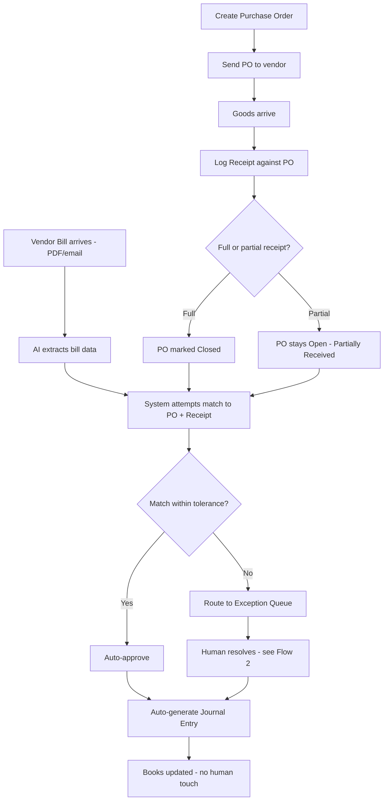
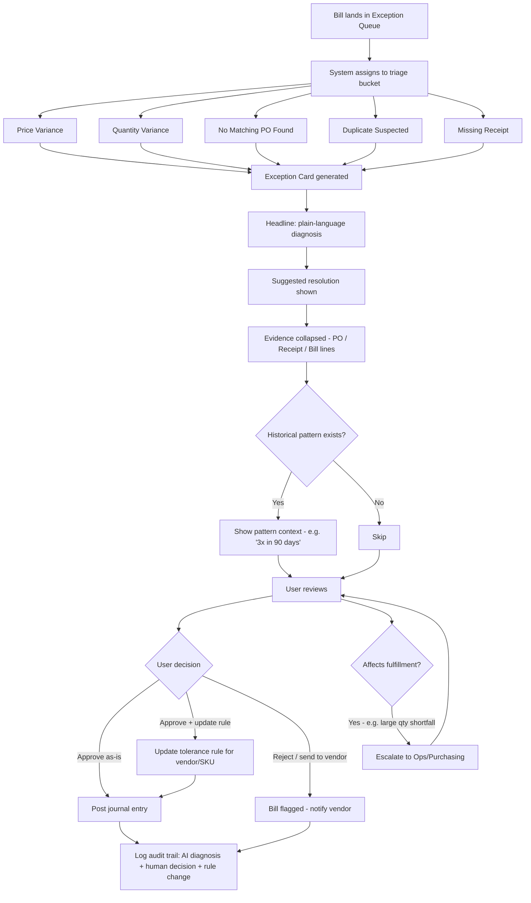
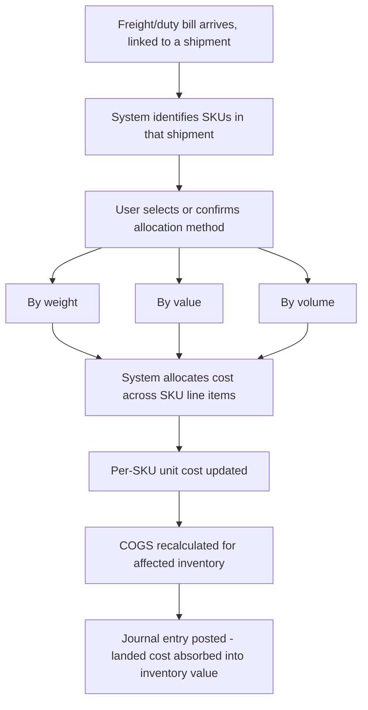
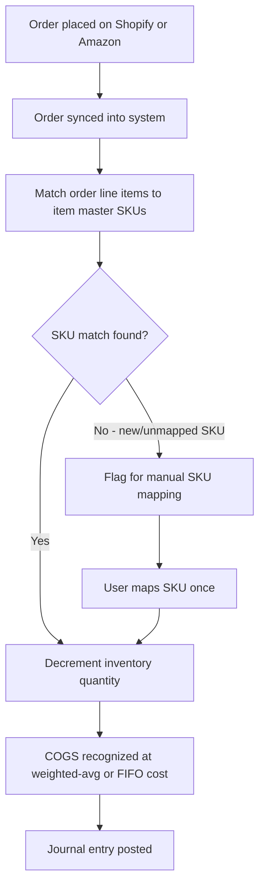

# AI Vendor Reconciliation: client scope document

> Supplied by the client as `AI Vendor Reconciliation.docx` (12 pages, 28 to 31 Aug 2026; md5
> `4044c35f93b594ec81637bb82c1bdb68`). Text extracted as written; the four embedded images are
> renders of the Flow diagrams below and add nothing else. The document opens at section 5 of
> an earlier numbering: sections 1 to 4 were never supplied. Yousuf called this document gospel
> on 11 Sep 2026. It was written for a DTC/importer audience; the client later corrected the
> target (see `../03-client-context.md`). Read it with those corrections.

## Scope of the Work for Vendor Reconciliation:

## 1. Ingestion — bill capture

The vendor bill arrives as a PDF, email attachment, or forwarded invoice. An LLM-based extraction step (not brittle OCR templates) pulls structured data: vendor, line items, SKUs/descriptions, quantities, unit prices, totals, payment terms. This needs to handle messy real-world bills — inconsistent formats, handwritten adjustments, multi-page invoices — which is exactly the kind of unstructured-document problem modern LLMs are good at and legacy OCR-template systems (what NetSuite's bill-capture add-ons typically use) are bad at.

## 2. Matching — the actual "three-way match"

The system pulls the corresponding PO (by PO number if referenced, or by fuzzy-matching vendor + line items + timing if not) and the receiving record (goods receipt) for that PO. It compares three things line-by-line:

Quantity ordered vs. received vs. billed

Price on PO vs. price on bill

Item/SKU identity (accounting for the vendor using different SKU codes or descriptions than your item master — another place fuzzy/semantic matching beats exact-string matching)

## 3. Tolerance-based auto-approval

Instead of a human checking every line, the system applies configurable tolerance rules — e.g., auto-approve if quantities match exactly and price variance is under 2%, or under a fixed dollar threshold. Most bills that are genuinely clean flow straight through with zero human touch. This mirrors what Rillet does for cash reconciliation (auto-match transactions within tolerance, surface only the exceptions), just applied to goods instead of cash.

## 4. Exception handling — where the real value is

The bills that don't cleanly match are the ones a clerk would spend the most time on anyway — partial shipments, price changes, quantity discrepancies, split deliveries. Here the AI's job isn't just to flag "mismatch" but to explain it in plain language: "Billed 500 units at $4.20, but PO was for 500 units at $4.00 — vendor increased price by 5% with no PO amendment on file" or "Received 480 of 500 ordered units — bill is for full 500, likely a partial shipment not yet reconciled." That's a genuine AI-native improvement over a legacy system that just throws a red flag with no context, forcing the human to dig through three screens to figure out what happened.

## 5. Landed cost allocation, automatically triggered

Once a bill for freight or duty comes in against a receiving record, the system can automatically allocate that cost across the SKUs in the shipment (by weight, value, or volume) and update true unit cost — the step that's almost entirely manual (spreadsheet-based) at inventory-heavy SMBs today.

## 6. GL posting

Once matched (or manually approved past an exception), the system auto-generates the journal entry — debiting inventory/COGS and crediting AP — with full audit trail back to the PO, receipt, and bill. This is the part that has to feel like Rillet's "continuous close" pitch: the books are current in near-real-time, not reconstructed at month-end.

## The inbox — triaged, not a flat list

Instead of a generic "AP inbox," exceptions should be bucketed by type of problem, because the judgment required differs:

Price variance — vendor billed differently than PO'd

Quantity variance — partial shipment, over-shipment, or short-ship

No matching PO found — bill came in with no corresponding PO (or a fuzzy match below confidence threshold)

Duplicate suspected — bill looks like it might already be paid/entered

Missing receipt — bill arrived before goods were logged as received

Sorting by type (not just "flagged/unflagged") lets someone batch through all price variances in one sitting, which is a fundamentally different mental task than resolving quantity mismatches.

## Each exception card — pre-diagnosed, not raw data

For any given exception, the screen shouldn't dump the PO, the receipt, and the bill side by side and expect the human to spot the difference (that's the old NetSuite experience). It should lead with the AI's plain-language diagnosis, then let the human drill into evidence only if they want to:

Headline: "Vendor increased unit price 5% vs. PO ($4.00 → $4.20), no PO amendment on file."

One-line suggested resolution: "Approve if this is a known price increase, otherwise flag to vendor."

Underneath, collapsed by default: the actual PO line, receipt line, and bill line for verification

Historical context where useful: "This vendor has changed price without PO amendment 3 times in the last 90 days" — pattern surfacing that a human wouldn't catch bill-by-bill but the system can, since it sees every transaction.

## Resolution should be one click for the common cases

Three buttons cover the vast majority of exceptions: Approve as-is, Approve and update PO/tolerance rule (so the same vendor's next 5% variance auto-clears instead of re-flagging), and Reject / send back to vendor. The "update the rule" option matters a lot — it's what makes the system get smarter and quieter over time instead of generating the same category of exception every month forever.

## Escalation path for genuine judgment calls

Some exceptions aren't resolvable by the AP clerk alone — e.g., a large quantity shortfall that affects whether a customer order can ship. Those should route to the right person (ops/purchasing, not just finance) with the relevant context attached, rather than sitting in an AP queue where nobody has the operational knowledge to resolve it.

## Audit trail, automatic

Whatever resolution path is taken, the system logs the reasoning (AI's diagnosis + human's decision + any rule change) against the PO/receipt/bill chain — this is the same "complete audit trail" argument Rillet makes for its GL, and it matters just as much here for anyone who'll eventually face an audit or diligence process.

## The metric that proves it's working

The dashboard should track "% of bills requiring human touch" over time, trending down as tolerance rules and vendor-specific learning improve — that's the visible proof point for the CFO/ops lead that the system is paying for itself, mirroring how Rillet sells "close your books in days" as its headline metric.

## Core Data Model (high level)

Item — SKU, variant, UoM, default cost method, current unit cost

Vendor — name, terms, contact, historical variance patterns

Purchase Order — vendor, line items (item, qty, unit price), status, expected delivery

Receipt — linked to PO, line items received (qty, date), partial receipt supported

Vendor Bill — linked to PO/receipt (or unlinked if no match found), line items, extracted via AI capture

Match Result — PO + Receipt + Bill comparison, status (auto-matched / exception / resolved), tolerance rule applied

Landed Cost Allocation — shipment-level freight/duty, allocation method, resulting per-SKU cost adjustment

Journal Entry — auto-generated from matched transactions, full audit trail back to source documents

Sales Order (from channel sync) — channel, SKU, qty, triggers inventory decrement

## 5. Build Sequencing (suggested phases)

Phase 1 — Core ledger + item master + manual PO/bill entry Prove the unified data model works before adding AI automation on top. No channel sync yet.

Phase 2 — AI bill capture + three-way match + exception workflow This is the differentiating layer — where the "AI-native" pitch becomes real and demoable.

Phase 3 — Landed cost automation + Shopify/Amazon sync Rounds out the "true COGS in real time" value prop for the DTC/importer ICP.

Phase 4 — Expand tolerance-rule learning, vendor pattern detection, second channel integrations Based on what early customers actually ask for — resist scope creep here.

User Interface 

## User Flow — AI-Native Inventory Reconciliation (MVP)

## Flow 1: End-to-End Purchase-to-Bill Lifecycle

Key moment: the vast majority of clean bills should flow from arrival to posted journal entry with zero human interaction (top path). The exception queue (Flow 2) is where the human's time actually goes.

## Flow 2: Exception Resolution (the core differentiator)

Key moment: most exceptions resolve in one click (Approve, Approve+update rule, or Reject). The "update rule" path is what makes the queue shrink over time instead of regenerating the same noise every cycle.

## Flow 3: Landed Cost Allocation

## Flow 4: Multi-Channel Order → Inventory Decrement

## Screen-Level Notes (for design handoff)

Exception Queue (primary screen)

Left rail: bucket filters (Price Variance, Quantity Variance, No PO Found, Duplicate, Missing Receipt) with counts

Main pane: card list, sorted by dollar impact or age (toggle)

Each card collapsed by default to headline + suggested action; expand for evidence

Exception Card (expanded state)

Top: plain-language diagnosis + suggested resolution

Middle: three-column evidence view (PO line / Receipt line / Bill line) — only shown on expand

Bottom: pattern context banner (if applicable) + three action buttons (Approve / Approve+Update Rule / Reject)

Dashboard (proof-point screen)

Primary metric: "% of bills requiring human touch" trend line over time

Secondary: open PO value, exceptions by bucket, average time-to-resolution

PO / Receiving screens

Kept intentionally simple in v1 — status pipeline (Draft → Sent → Partially Received → Closed), no advanced approval routing yet (add later if customer demand emerges)

## Notes

These flows assume the Phase 2 build (AI bill capture + matching) is live; Phase 1 (manual entry, no AI) would strip out the auto-match/auto-post branches and route everything through manual review.

Diagrams are intentionally at "happy path + primary branch" level of detail — edge cases (e.g., bill amendments after posting, multi-PO bills) should get their own flow docs once core flows are validated with early customers.
